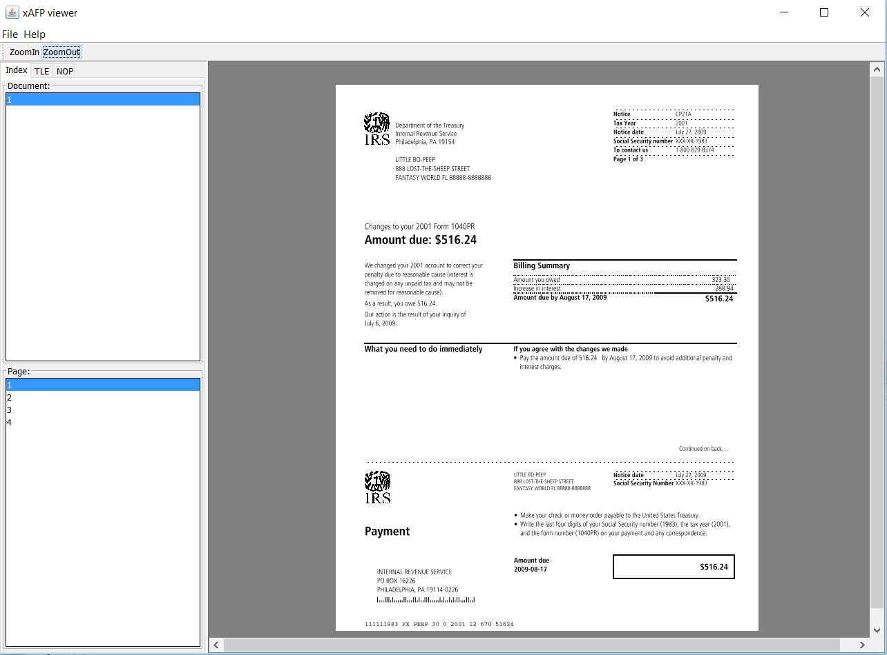

# xafp
An AFP print file renderer, AFP to image converter, AFP file parser.  
IBM AFP 打印格式文件解析库，可渲染，分析，AFP文件转图片等。 

# Usage
      Usage: java -jar xafp.jar [options] [afp_file_path]

      Options:
        -dpi                             : "-dpi 300", otherwise, use resolution defined in file
        -page                            : "-page 1 4", page number from 1 to n
        -dumpNop                         : "-dumpNop dump_file_path", dump all NOPs to file
        -dumpTLE                         : "-dumpTLE dump_file_path", dump all TLEs to file
        
        转换图片(图片生成在AFP 文件同目录下, 图片格式默认jpg)：
            java -jar xafp.jar c:/test.afp
        指定页范围：
            java -jar xafp.jar -page 1 2 c:/test.afp 
        指定某一页：
            java -jar xafp.jar -page 1 1 c:/test.afp 
        提取TLE到文本文件
            java -jar xafp.jar c:/test.afp -dumpTLE c:/test_tle.txt
## AFP viewer
      java -jar xafp.jar
      直接执行将打开AFP viewer
      
# build
      Clone or download project, run maven:
            npm clean install
# binary download
[xafp.jar](https://github.com/lumpchen/xafp/raw/master/dst/xafp.jar)
      
# maven dependency
------------------
## Release
      <dependency>
            <groupId>com.github.lumpchen</groupId>
            <artifactId>xafp</artifactId>
            <version>1.0.0</version>
      </dependency>
## Snapshot
      <dependency>
            <groupId>com.github.lumpchen</groupId>
            <artifactId>xafp</artifactId>
            <version>1.0.1-SNAPSHOT</version>
      </dependency>
